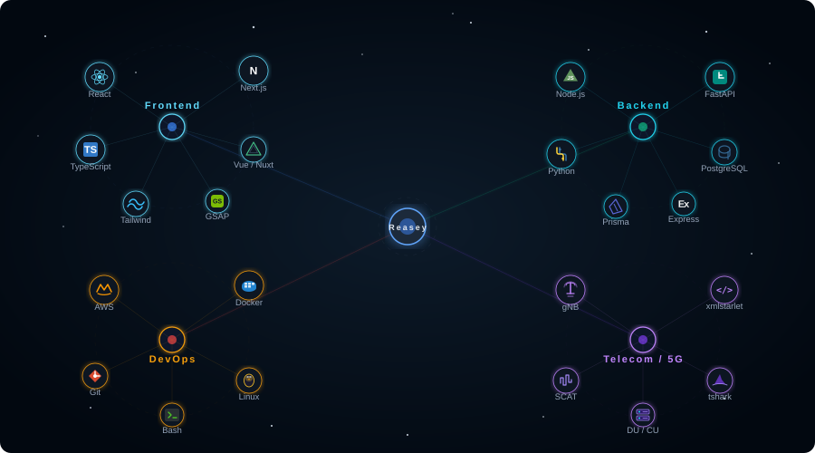

<h1 align="center">
  
</h1>

  <em>Software Engineer. Currently Working in Tokyo, Japan</em>

 

<!-- ═══════════════ GITHUB STATS & STREAK ═══════════════ -->

<table align="center">
  <tr>
    <td align="center" width="50%">
      
    </td>
    <td align="center" width="50%">
      
    </td>
  </tr>
</table>

<!-- ═══════════════ METRICS: HEADER & BASE ═══════════════ -->

  

<!-- ═══════════════ METRICS: ISOMETRIC CALENDAR + FOLLOW-UP ═══════════════ -->

<table align="center">
  <tr>
    <td align="center" width="50%">
      <h3>📅 Isometric Commit Calendar</h3>
      
    </td>
    <td align="center" width="50%">
      <h3>🎟️ Issues & Pull Requests</h3>
      
    </td>
  </tr>
</table>

<!-- ═══════════════ METRICS: LANGUAGES + LINES ═══════════════ -->

<table align="center">
  <tr>
    <td align="center" width="50%">
      <h3>🈷️ Languages Activity</h3>
      
    </td>
    <td align="center" width="50%">
      <h3>👨‍💻 Lines of Code</h3>
      
    </td>
  </tr>
</table>

 

<!-- ═══════════════ SKILL CONSTELLATION ═══════════════ -->

<h2>🧰 Tech Skills</h2>

  

**Frontend**

  

  

**Backend**

  

**DevOps & Cloud**

  

**Telecom / 5G**

  
  
  

**IDE, Package Manager & Version Control**

  

 

<!-- ═══════════════ CONNECT ═══════════════ -->

  
  
  

  

  <em>These infographics were generated using <a href="https://github.com/lowlighter/metrics">lowlighter/metrics</a></em>

